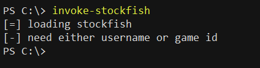

# invoke-stockfish

A script to automate engine analysis of live games on [LC](https://lichess.org/). 
*Engine assistance on rated games is against [LC's rules](https://lichess.org/terms-of-service).*

### getting started
You'll need to have downloaded [Stockfish](https://stockfishchess.org/download/). Modify the first line of the script to include the file path of the executable file. You'll also need the python packages in [requirements.txt](requirements.txt). Install those with `pip install -r requirements.txt`. Run the script without arguments. If the script asks for a username or game id after loading stockfish, you're good to go.

Run the script with either a username supplied to -u, or a game id/url supplied to -g. The script automatically injects itself into the websocket stream of the game and runs a stockfish analysis of each move (depth=15), giving as output the evaluation and best next move.

### example
It is normally thought that bullet games are less susceptible to engine assistance because of the shorter time control. Here is an example of the script used in a bullet game:

https://github.com/user-attachments/assets/1e4112da-79f6-4efa-8a06-16700aa862d4

The automation allows the user to decide when to refer to the engine evaluation and how to use it with restraint, thus avoiding detection. The post-game analysis of the example is summarised like so:

The number of blunders and inaccuracies is comparable between the two players. The pattern of eval values isn't suspiciously one-sided:

The move times show variation patterns similar to that of non-engine-assisted play:

